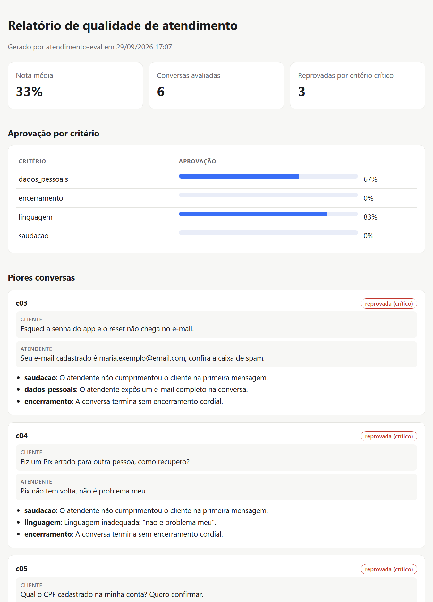

# atendimento-eval

[](https://github.com/arthurpenedo/atendimento-eval/actions/workflows/ci.yml)
[](https://github.com/arthurpenedo/atendimento-eval/actions/workflows/relatorio.yml)


> Avalia a qualidade de atendimentos (de humanos ou de bots) combinando **checagens determinísticas** com um **LLM como juiz**, e compara versões de prompt para pegar **regressões antes de ir para produção**.

## O problema

Times de atendimento, principalmente em bancos e fintechs, monitoram só uma amostra pequena das conversas, à mão, com planilha. Quando um chatbot com IA entra em cena, surge uma pergunta nova: **o prompt novo é melhor que o antigo, ou só diferente?**

O `atendimento-eval` responde isso com um pipeline de avaliação:

1. **Regras objetivas em código:** saudação, encerramento, linguagem inadequada e **vazamento de dados pessoais (LGPD)**, como CPF, cartão ou e-mail completos.
2. **Critérios subjetivos com LLM-as-judge:** resolução, empatia e clareza, com nota de 1 a 5, justificativa e **trecho da conversa como evidência**.
3. **Critérios críticos zeram a nota.** Um vazamento de CPF não é compensado por um atendimento simpático.
4. **Comparação A/B entre versões**, com código de saída ≠ 0 quando há regressão, pronta para usar no CI.
5. **Relatório HTML** com as piores conversas, a transcrição e o motivo de cada reprovação, para quem revisa sem abrir JSON.

## Demo

**Relatório ao vivo:** [arthurpenedo.github.io/atendimento-eval](https://arthurpenedo.github.io/atendimento-eval/) (versão v2 comparada com a v1, atualizado pelo CI a cada push).

Mesmas 6 demandas de clientes de um banco fictício, respondidas por duas versões de um bot:

```text
$ atendimento-eval avaliar data/conversas_v1.jsonl --saida v1.json
Nota média: 33%
Reprovadas por critério crítico: 3

Aprovação por critério:
  dados_pessoais   █████████████        67%
  encerramento                          0%
  linguagem        █████████████████    83%
  saudacao                              0%

$ atendimento-eval avaliar data/conversas_v2.jsonl --saida v2.json
Nota média: 100%

$ atendimento-eval comparar v1.json v2.json
Variação da nota média: +66.6%
  dados_pessoais   +33%
  encerramento     +100%
  linguagem        +17%
  saudacao         +100%

Sem regressões.
```

Com `--juiz`, os critérios `resolucao`, `empatia` e `clareza` também são avaliados pelo Claude.

### Relatório HTML

```text
$ atendimento-eval avaliar data/conversas_v2.jsonl --html relatorio.html --base v1.json
```

Um único arquivo, sem dependências, com modo escuro. Com `--base`, mostra a variação de cada critério contra a versão anterior e sinaliza regressões.



### Regressão no CI

O workflow [`relatorio.yml`](.github/workflows/relatorio.yml) avalia as duas versões a cada push e pull request, **falha se a versão nova regredir** em qualquer critério anexa os relatórios HTML à execução e publica o da `main` no [GitHub Pages](https://arthurpenedo.github.io/atendimento-eval/). É o mesmo fluxo que um time usaria para aprovar uma mudança de prompt.

## Arquitetura

```
conversas.jsonl ──► evaluator ──┬──► checks.py (regex, sem custo) ──────┐
rubrica.yaml ────►              └──► judge.py (Claude, JSON Schema) ────┼──► nota ponderada
                                                                        │    + veto de críticos
                                                                        ▼
                                              summarize() ──► compare(v1, v2) ──► regressões?
```

- **Rubrica em YAML** (`rubricas/padrao.yaml`): cada critério tem peso, tipo (`deterministico` ou `llm`) e se é crítico. Dá para trocar de rubrica sem mexer em código.
- **Juiz** (`judge.py`): Claude (`claude-opus-5-5`) com saída estruturada em JSON Schema, tratamento de recusa e fallback no servidor. Se o juiz não avaliar um critério, ele conta como reprovado, sem nota inventada.

### Decisões técnicas

- **Regex onde regex basta.** Detectar CPF é determinístico: mais barato, mais rápido e auditável do que perguntar a um LLM. O juiz fica só com o que exige interpretação.
- **Evidência obrigatória.** O juiz precisa citar o trecho da conversa que justifica cada nota, o que facilita auditar o próprio juiz.
- **Dataset 100% sintético.** Nenhuma conversa real. O gerador está em `data/gerar_dataset.py`.

## Como rodar

```bash
git clone https://github.com/arthurpenedo/atendimento-eval && cd atendimento-eval
pip install -e ".[dev]"

atendimento-eval avaliar data/conversas_v1.jsonl --saida v1.json
atendimento-eval avaliar data/conversas_v2.jsonl --html relatorio.html --base v1.json
atendimento-eval avaliar data/conversas_v2.jsonl --juiz   # precisa de ANTHROPIC_API_KEY
pytest -q
```

Formato de entrada (JSONL, uma conversa por linha):

```json
{"id": "c01", "canal": "chat", "turns": [{"role": "cliente", "text": "..."}, {"role": "atendente", "text": "..."}]}
```

## Próximos passos

- [x] Relatório HTML com as piores conversas e o motivo de cada reprovação
- [ ] Concordância juiz × avaliador humano (kappa) em uma amostra rotulada
- [ ] Avaliação em lote com a Batches API (50% mais barata)
- [x] GitHub Action que roda a comparação a cada mudança
- [x] Demo pública do relatório no GitHub Pages
- [ ] Evidências do juiz LLM destacadas na transcrição

---

Feito por [Arthur Penedo](https://github.com/arthurpenedo) · [LinkedIn](https://www.linkedin.com/in/arthuralves-penedo)
